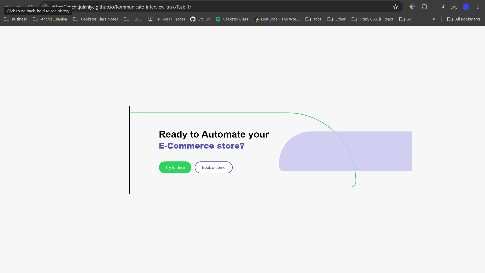
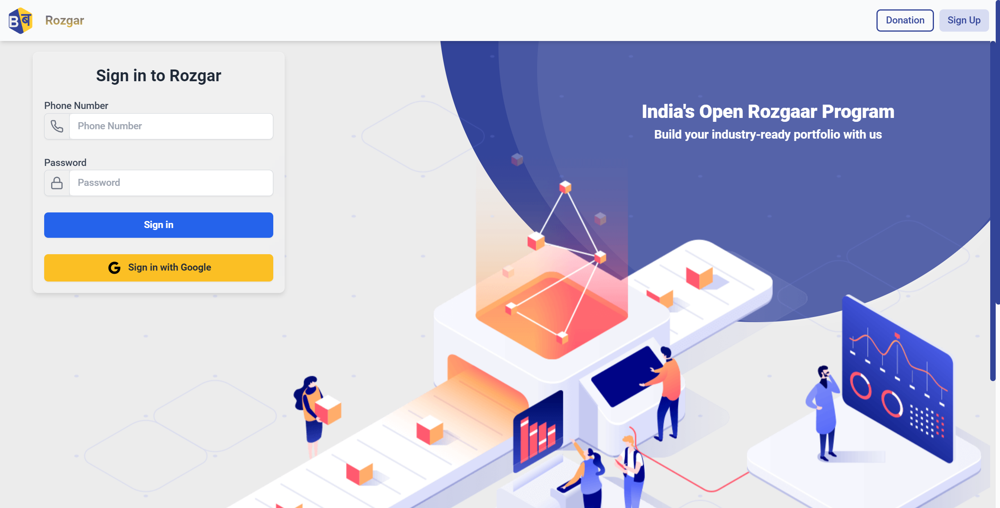

# Kommunicate JavaScript Assignments

This repository contains solutions to several JavaScript problems provided as part of Kommunicate's assignments. Below is a brief overview of the tasks addressed.

## Table of Contents
1. [Task](https://anchitjulaniya.github.io/Kommunicate_interview_task/Task_1/)
2. [Reverse a Number](#reverse-a-number)
3. [Extract URL Parameter Value](#extract-url-parameter-value)
4. [Project Description](#project-description)

## 1. HTML & CSS Design [Link](https://anchitjulaniya.github.io/Kommunicate_interview_task/Task_1/)

### Task
Create a given image using only HTML and CSS. The goal is to match the design as closely as possible, focusing on layout, and styling.

---

## 2. Reverse a Number

### Task
Write a JavaScript function that reverses the digits of a given number. For example, input `149` should produce `941`.

---

## 3. Extract URL Parameter Value

### Task
Create a function that accepts a URL and a parameter name, returning the value of that parameter. For example, given the URL `https://www.kommunicate.io/poweredby?utm_medium=webplugin`, the function should return `webplugin` when querying the parameter `utm_medium`.

---

## 4. Project Description: Rozgar (Freelancing Project)

### Barabari Rozgar (Freelancing Project) 

[Link](https://rozgar-dashboard-frontend.onrender.com/)

[GitHub repository is Private](https://github.com/Barabari-Project/Rozgar-Dashboard-Frontend)

- Designed and implemented the SignIn page, SignUp page, Header, and a Lecture Dashboard with four tabs (Assignment Tab, Problems Tab, Lecture, Notes).
- Explored advanced features including API fetching, complex filtering, and powerful search options, enhancing the user experience.
- **Tech Stack**: HTML, CSS, Tailwind CSS, TypeScript, Redux, Node.js, Express.js, MongoDB.

---
