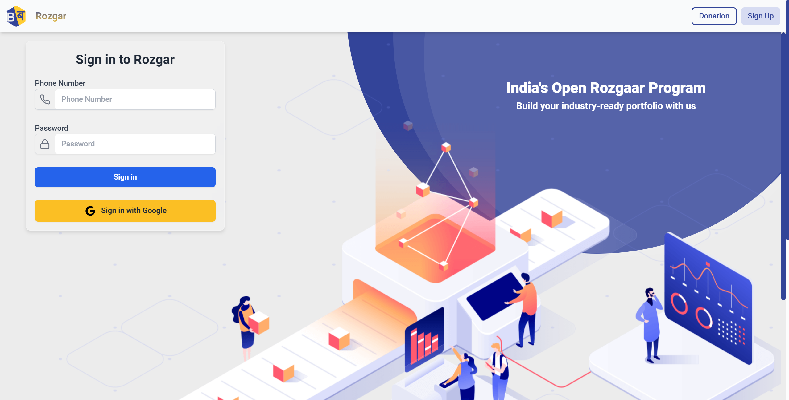

# [Rozgar (Freelancing Project)](https://rozgar-dashboard-frontend.onrender.com/)

## Project Overview

Barabari Rozgar is a freelancing project focused on designing and implementing key components of a web application. This project aimed to enhance the user experience by incorporating advanced features such as API fetching, complex filtering, and powerful search options. The primary objective was to create a seamless and intuitive interface for users.

## Key Features

- **SignIn and SignUp Pages**: Designed and implemented responsive and user-friendly SignIn and SignUp pages.
- **Header**: Developed a consistent and functional header across all pages.
- **Lecture Dashboard**: Created a dynamic dashboard with four main tabs:
  - **Assignment Tab**
  - **Problems Tab**
  - **Lecture**
  - **Notes**

## Tech Stack

- **HTML**
- **CSS**
- **Tailwind CSS**
- **TypeScript**
- **Redux**
- **Node.js**
- **Express.js**
- **MongoDB**

## Screenshots

### SignIn Page

### SignUp Page

### Lecture Dashboard

### Problem Dashboard

### Assignment Dashboard

### Notes Dashboard

## Links

- **GitHub Repository**: [GitHub Link](https://github.com/Barabari-Project/Rozgar-Dashboard-Frontend)
- **Live Demo**: [Hosted Application Link](https://rozgar-dashboard-frontend.onrender.com/)